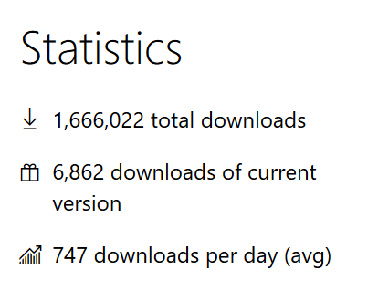
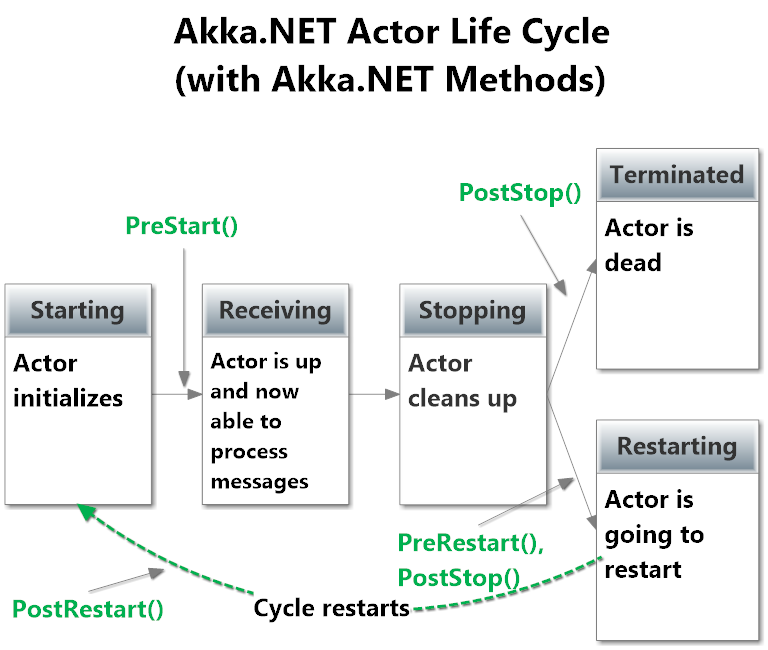
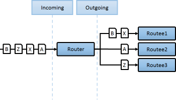

## Aktor-Systeme mit Akka.net 💫


[Alberto Gregorio](https://albertogregorio.com)

2020-04-27

----

Die meisten Materialien für diese Präsentation stammen aus dem [Petabridge Akka.NET Bootcamp](https://github.com/petabridge/akka-bootcamp), das unter Apache 2.0 lizenziert ist.

---

## Aktor-Modell ™


----

### Aktoren sind..

- <!-- .element: class="fragment" data-fragment-index="1" --> 🦄 Alles (Alles wird als Aktor modelliert)
- <!-- .element: class="fragment" data-fragment-index="2" --> 🎈 Leichtgewicht
- <!-- .element: class="fragment" data-fragment-index="3" --> 💾 Stateful
- <!-- .element: class="fragment" data-fragment-index="4" --> 👪 Organisiert in Aktor-Systeme
- <!-- .element: class="fragment" data-fragment-index="5" --> 🚩 Adressierbar

----

### Aktoren können..

- <!-- .element: class="fragment" data-fragment-index="1" --> 📬 Nachrichten sequentiell empfangen (und verarbeiten)
- <!-- .element: class="fragment" data-fragment-index="2" --> 🎭 Ihr Verhalten ändern (interner Zustand)
- <!-- .element: class="fragment" data-fragment-index="3" --> 👶 Andere Aktoren erstellen (Kinder)
- <!-- .element: class="fragment" data-fragment-index="4" --> 📧 Neue Nachrichten senden

----

### Location transparency

Wegen: <!-- .element: class="fragment" data-fragment-index="1" -->

- <!-- .element: class="fragment" data-fragment-index="1" --> Aktorenreferenzen statt direkter Kommunikation
- <!-- .element: class="fragment" data-fragment-index="1" --> Asynchrone Kommunikation nur über Nachrichten
- <!-- .element: class="fragment" data-fragment-index="1" --> Automatisches Routing für Nachrichten

Bekommt man: <!-- .element: class="fragment" data-fragment-index="2" -->

- <!-- .element: class="fragment" data-fragment-index="2" --> Die Aktoren können sich im selben Prozess oder in einer anderen AWS-Region befinden

---

## Akka.NET

".. is a toolkit and runtime for building highly concurrent, distributed, and fault tolerant event-driven applications on .NET & Mono."



----

### Akka.NET-Funktionen

- <!-- .element: class="fragment" data-fragment-index="1" --> 👪 Aktormodell
- <!-- .element: class="fragment" data-fragment-index="2" --> 🎈 Leichte Prozesse
  - <!-- .element: class="fragment" data-fragment-index="2" --> (1M+ Aktoren pro GB)
- <!-- .element: class="fragment" data-fragment-index="3" --> Ereignisbasierte Kommunikation
  - <!-- .element: class="fragment" data-fragment-index="3" --> 📧 Nachricht = Ereignis

----


- Erstmalige Veröffentlichung: Juli 2009
- Stabiles Release 28. Januar 2020
- Sprache: Scala
- Plattform: Java Virtual Machine (JVM)
- Lizenz: Apache-Lizenz 2.0

---

### Basische Aktoren

- `UntypedActor`
- `ReceiveActor`
- Und viele andere..

```csharp
// Top Level
var props = Props.Create<TopActor>("Top");
var myActor = MyActorSystem.ActorOf(props);

// Child (created inside Top Level)
var props2 = Props.Create(() => new ChildActor(), "Child");
IActorRef myChildActor = Context.ActorOf(props2);
```

`Props` = (serialisierbares) Rezept für die Aktorerstellung

----

### Context

- Aktueller Zustand des Aktors
- `IActorRefs` ( = Aktor "Handle")
  - `Sender` der aktuellen Nachricht
  - `Parent`
  - `Children`
  - ..

----

### Aktor-Referenzen

- `ActorPath` = Aktor-Adresse
  - Position in der Systemhierarchie


----

### Aktor-Gruppen (Selection)

- `ActorPath` kann Wildcards enthalten => Auswahl von Gruppen

```csharp

var selection = Context.ActorSelection("/path/*/actorName");


```

- `ActorSelection` sind relativ 
  - (im Gegensatz zu `IActorRef`) 

---

### Nachrichten senden

- Nachrichten sind normale `POCO`s
  - besser, wenn `immutable`
- Normalerweise asynchron gesendet (`.Tell()`)
- Können auch synchron gesendet werden (`.Ask()`)

```csharp

// fire and forget
actorRef.Tell("simple (string) message");

// send and wait for response
actorRef.Ask(new MyMessage(1,2.3,true,"that's all friends"));

// from inside the actor (special message!)
Self.Tell(PoisonPill.Instance);


```

----

### Nachrichten empfangen (Untyped)

- Die `Mailbox` 📥 bleibt zwischen Neustarts bestehen
- Der `Stash` 🗃 ist temporär

```csharp
protected override void OnReceive(object message)
{
    if (message is Messages.MessageType1)
    {
        // .. do something
        Sender.
    }
    else
    {
        Unhandled(message);
    }
}
```

----

### Nachrichten empfangen (ReceiveActor)

```csharp

Receive<string>(s => s.StartsWith("AkkaDotNet"), s =>
{
    // handle string
});

Receive<Foo>(foo => foo.Count < 4 && foo.Max > 10, foo =>
{
    // handle foo
});

```

---

### Aktor-Systeme

- Verweis auf das `Akka.NET` Framework
- Verwaltet die Lebenszeit der Aktoren
- `Context` für die Aktoren
- Erstellt 🔝 Aktoren

```csharp

var myActorSystem = ActorSystem.Create("MyActorSystem");

```

- ⚠ Es ist ein **schweres** Objekt! (1x/App) ⚠

----

### Aktor-Hierarchie

- Atomisiert Arbeit (divide and conquer)
- Enthält Fehler (resilient System)

 <!-- .element class="big" -->

----

### Überwachung

- Jeder 👨 Aktor überwacht seine 👶 Unteraktoren
- Es gibt 🔝 "globale" Wächter (aka Guardians)


----

### Supervision Directives

1. <!-- .element: class="fragment" data-fragment-index="1" --> 🔂 Das Kind neu starten (Standard)
2. <!-- .element: class="fragment" data-fragment-index="2" --> ⏹ Das Kind Stoppen (beenden)
3. <!-- .element: class="fragment" data-fragment-index="3" --> ⏫ Den Fehler eskalieren
4. <!-- .element: class="fragment" data-fragment-index="4" --> ⏩ Verarbeitung wieder aufnehmen (ignorieren)

----

### Supervision Strategies

- <!-- .element: class="fragment" data-fragment-index="1" --> Die Aufsicht fungiert als aktorbasierter "Try-Catch"
- <!-- .element: class="fragment" data-fragment-index="2" --> One-For-One Strategy (Standard)
- <!-- .element: class="fragment" data-fragment-index="2" --> All-For-One Strategy
- <!-- .element: class="fragment" data-fragment-index="3" --> Fehlerkommunikation erfolgt über Systemnachrichten

----

### Let it crash ®

- Jeder Aktor ist Wächter für seine Kinder
- Aktoren stellen sich selbst wieder her

----

### Lifecycle

  <!-- .element class="big" -->

---

## Scheduler

`ActorSystem.Scheduler` ist ein Singleton in jedem Aktor

- `ScheduleTellOnce()`
- `ScheduleTellRepeatedly()`

---

### Routers

- Besondere Art von Aktoren
- Messaging-Hub an eine Gruppe anderer Aktoren
- Zweck: Aufgaben gleichmäßig verteilen
- `Sender` einer an einen Routee gelieferte Nachricht ist der Aktor, der die Nachricht gesendet hat
  - Der Router leitet die Nachricht nur weiter
- Spezielle Router-Nachrichten:
  - `Broadcast`
  - `GetRoutees`

----

### Pool Router

- Router, der seine Aktoren erstellt und verwaltet ("routees")
- Es werden `NrOfInstances` erstellt (und überwacht)

Note: something something

----

### Group Router

- Erstellt seine "routees" nicht
- Überwacht seine "routees" nicht
- Leitet nur Nachrichten weiter
- Routees werden mit `ActorPaths` gefunden

----

### Routing Strategy: Consitent Hash

  <!-- .element class="big" -->

----

### Routing Strategy: Broadcast

  <!-- .element class="big" -->

----

### Routing Strategy: Round Robin

  <!-- .element class="big" -->

---

### Akka.Remote

- Location Transparency
  - `RemoteActorRef : IActorRef`
- Netzwerk-Transport Abstraktion
- Stark typisierte Serialisierung
  - basierend auf Fully Qualified Names (FQN)
  - Gemeinsame Assemblies nutzen!
- Ermöglicht den Einsatz von Aktoren aus der Ferne

----

## Andere Akka.NET Teilen

- <!-- .element: class="fragment" data-fragment-index="1" --> 🕸 Akka.Cluster
- <!-- .element: class="fragment" data-fragment-index="2" --> 💾 Akka.Persistence
- <!-- .element: class="fragment" data-fragment-index="3" --> 🗜 Akka.Streams

---

## Akka.net Vorteile

- <!-- .element: class="fragment" data-fragment-index="1" --> ♦ Resilient
- <!-- .element: class="fragment" data-fragment-index="2" --> 🗻 Skalierbar
- <!-- .element: class="fragment" data-fragment-index="3" --> 🏎 Sehr leistungsstark

----

## Akka.net Nachteile

- <!-- .element: class="fragment" data-fragment-index="1" --> ❔ Neues Paradigma
- <!-- .element: class="fragment" data-fragment-index="2" --> 🙋 Eingeschränkte Unterstützung
- <!-- .element: class="fragment" data-fragment-index="3" --> 🕸 Komplexe verteilte Logik ist immer noch komplex

---

### Alternativen: Distributed Computing

[Microsoft Orleans](https://dotnet.github.io/orleans/)


----

### Alternativen: Serverless

[Azure Functions](https://azure.microsoft.com/de-de/services/functions/)


---

### Wo findet man mehr Info?

- [Akka.net (docs, howto)](http://getakka.net)
- [GitHub repo](https://github.com/akkadotnet/akka.net)
- [Petabridge (bootcamps)](http://akka.net)
- [Lightbend/Typesafe (original Akka devs)](https://www.lightbend.com/akka-platform)