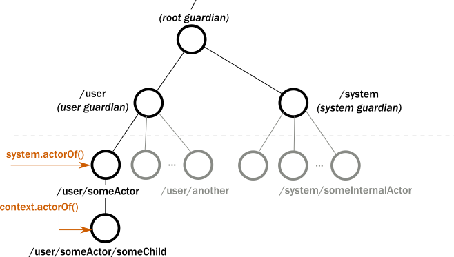
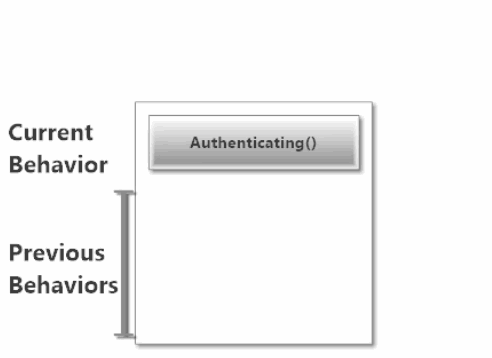
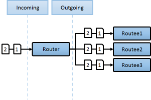
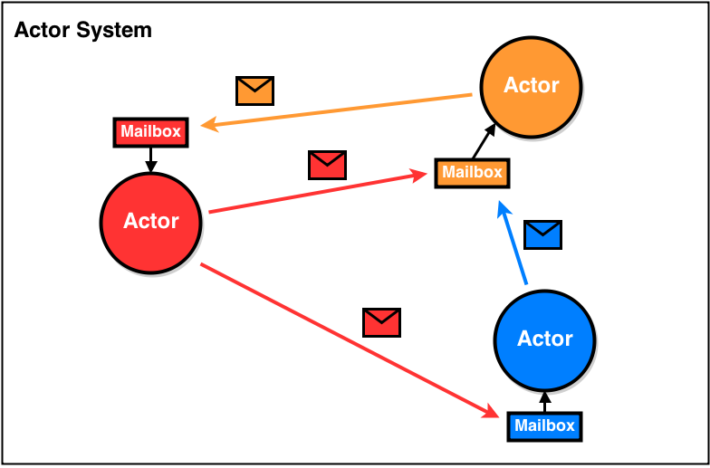

## Actor Systems with Akka.net 💫


[Alberto Gregorio](https://albertogregorio.com)

2020-04-18

----

Most of the materials for this presentation are taken from the [Petabridge Akka.NET Bootcamp](https://github.com/petabridge/akka-bootcamp) which is licensed under Apache 2.0.

---

## Actor Model


----

What is an Actor?

----

History of the actor model

----

### Actors are..

- everything 🦄 (Everything is an actor)
- lightweight
- stateful
- organized in Actor Systems

----

### Actors can..

1. Receive and process messages **sequentially** 📧
2. Change its behavior (internal state)
3. Send new messages
4. Create other actors (span children 👶)

----

### Location transparency

- Actor References instead of direct communication
- Communication only via messages (that can be routed)
- Dead letter concept
- Actors can be located in the same machine or in a different country

---

## Akka.NET

".. is a toolkit and runtime for building highly concurrent, distributed, and fault tolerant event-driven applications on .NET & Mono."


----

- Actor Model
- Lightweight event-driven processes (1M+ actors per GB)
- Event (aka Message) -based Communication

----

Simple and high-level abstractions for concurrency and parallelism

----

### Let it crash

- Supervisor hierarchy
- Self restoring
- Persistency/Journaling

----

### Where does Akka.net comes from

- Scala (JVM)
- Akka
  - add stats

----

### Basic Actors

Created based on `Props` object (the recipe of actor creation)

- `UntypedActor`
- `ReceiveActor`
- And many more..

```csharp
// Top Level
var props = Props.Create<TopActor>("Top");
var myActor = MyActorSystem.ActorOf(props);

// Child (created inside Top Level)
var props2 = Props.Create(() => new ChildActor(), "Child");
IActorRef myChildActor = Context.ActorOf(props2);
```

----

### Context

The Context holds metadata about the current state of the actor, such as the Sender of the current message and things like current actors Parent or Children.

Parent, Children, and Sender all provide IActorRefs that you can use.

----

### Actor References

All actors have an address (technically, an `ActorPath`) which represents where they are in the system hierarchy, and you can get a handle to them (get their `IActorRef`) by looking them up by their address.


----

### Actor Selection

Use `ActorPaths` and wildcards to create "Selections" of actors.

They are not meant to be passed around (unlike `IActorRef`) because they can be relative!

```csharp

var selection = Context.ActorSelection("/path/to/actorName");


```

----

### Send Messages

- Messages are normal POCOs (better if immutable).
- Usually sent asynchronously (`.Tell()`)
- Can also be sent synchronously (`.`)

- `PoisonPill`


```csharp

// fire and forget
actorRef.Tell("simple (string) message");

// send and wait for response
actorRef.Ask(new MyMessage(1,2.3,true,"that's all friends"));

// inside the actor..
Self.Tell(PoisonPill.Instance);


```


----

### Receive Messages (Untyped)

Messages in `Mailbox` are persisted between restarts (the ones in the `Stash` do not).

```csharp
protected override void OnReceive(object message)
{
    if (message is Messages.MessageType1)
    {
        // .. do something
        Sender.
    }
    else
    {
        Unhandled(message);
    }
}
```

----

### Receive Messages (ReceiveActor)

```csharp

Receive<string>(s => s.StartsWith("AkkaDotNet"), s =>
{
    // handle string
});

Receive<Foo>(foo => foo.Count < 4 && foo.Max > 10, foo =>
{
    // handle foo
});

```

----

### Actor System

- Reference to the Akka.NET Framework
- Manages the lifetime of the actors
- Context for the actors
- It is a "heavy" object! (create 1 per app)

```csharp

var myActorSystem = ActorSystem.Create("MyActorSystem");

```

----

### Actor Hierarchy

When you create the actor on the ActorSystem directly (as above), it is a top-level actor.

There are two key reasons actors exist in a hierarchy:

- To atomize work and turn massive amounts of data into manageable chunks
- To contain errors and make the system resilient



----

### Supervision

The "top" actors supervise their "sub" actors


----

### Supervision Directives

Types of supervision directives (i.e. what decisions a supervisor can make):

- Restart the child (default): this is the common case, and the default.
- Stop the child: this permanently terminates the child actor.
- Escalate the error (and stop itself): this is the parent saying "I don't know what to do! I'm gonna stop everything and ask MY parent!"
- Resume processing (ignores the error): you generally won't use this. Ignore it for now.

----

### Supervision Strategies

There are two built-in supervision strategies:

- One-For-One Strategy (default)
- All-For-One Strategy

The supervision acts as an actor-based "try-catch". The communication of Failures is done with `System Messages`.


----

### Lifecycle


----

### States (stack state)

#### Become/Unbecome




----

## Scheduler

`ActorSystem.Scheduler` is a singleton inside every actor.

- `ScheduleTellOnce()`
- `ScheduleTellRepeatedly()`

----

## Routers

A Router is a special kind of actor that acts as a messaging hub to a group of other actors. The purpose of a Router is to divide and balance work (represented as message streams) across some group of other actors, which will actually do the work.
What's special about a Router?

A Router actually is an actor, but with one critical difference: it can process more than one message at a time.

The Sender of a message delivered to a routee is the actor who sent the message to the router. The router just forwards the message. A router is effectively transparent, and only works in one direction: to its routees.

Special messages:

- `Broadcast`
- `GetRoutees`

----

### Routing Strategy





----

### Routing

----

### Pool Router

A "Pool" router is a Router that creates and manages its worker actors ("routees"). You provide a NrOfInstances to the router and the router will handle routee creation (and supervision) by itself.

----

### Group Router

A group router is a router that does not create/manage its routees. It only forwards them messages. You specify the routees when creating the group router by passing the router the ActorPaths for each routee.

A group router does not supervise its routees.

----

## Remote

- Akka.Remote

-----

## Overview of other capabilities

- Akka.Cluster
- Akka.Persistence
- Akka.Streams

----

## Akka.net Pros

- Resilient
- Scalable
- Very performant

----

## Akka.net Cons

- Not so easy to get started
- Yet another abstraction
- Complex distributed logic is still complex

---

### Alternatives: Distributed Computing

[Microsoft Orleans](https://dotnet.github.io/orleans/)


----

### Alternatives: Serverless

[Azure Functions](https://azure.microsoft.com/de-de/services/functions/)


----

### Where to find more info

- [Akka.net (docs, howto)](http://getakka.net)
- [GitHub repo](https://github.com/akkadotnet/akka.net)
- [Petabridge (bootcamps)](http://akka.net)
- [Lightbend/Typesafe (original Akka devs)](https://www.lightbend.com/akka-platform)

-----


