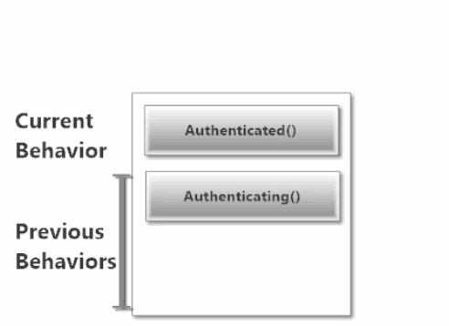
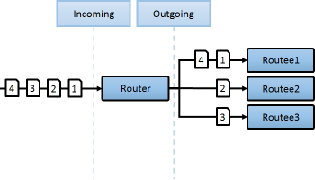

## Actor Systems with Akka.net 💫


[Alberto Gregorio](https://albertogregorio.com)

2020-04-18

----

Most of the materials for this presentation are taken from the [Petabridge Akka.NET Bootcamp](https://github.com/petabridge/akka-bootcamp) which is licensed under Apache 2.0.

---

## Actor Model ™


----

### Actors are..

- <!-- .element: class="fragment" data-fragment-index="1" --> 🦄 Everything (Everything is an actor)
- <!-- .element: class="fragment" data-fragment-index="2" --> 🎈 Lightweight
- <!-- .element: class="fragment" data-fragment-index="3" --> 💾 Stateful
- <!-- .element: class="fragment" data-fragment-index="4" --> 👪 Organized in Actor Systems
- <!-- .element: class="fragment" data-fragment-index="5" --> 🚩 Addressable

----

### Actors can..

- <!-- .element: class="fragment" data-fragment-index="1" --> 📬 Receive (and process) messages sequentially
- <!-- .element: class="fragment" data-fragment-index="2" --> 🎭 Change its behavior  (internal state)
- <!-- .element: class="fragment" data-fragment-index="3" --> 👶 Create other actors (span children)
- <!-- .element: class="fragment" data-fragment-index="4" --> 📧 Send new messages

----

### Location transparency

Because of: <!-- .element: class="fragment" data-fragment-index="1" -->

- <!-- .element: class="fragment" data-fragment-index="1" --> Actor references instead of direct communication
- <!-- .element: class="fragment" data-fragment-index="1" --> Asynchronous communication only via messages
- <!-- .element: class="fragment" data-fragment-index="1" --> Automatic routing for messages

We get: <!-- .element: class="fragment" data-fragment-index="2" -->

- <!-- .element: class="fragment" data-fragment-index="2" --> Actors can be located in the same process or in a different AWS region

---

## Akka.NET

".. is a toolkit and runtime for building highly concurrent, distributed, and fault tolerant event-driven applications on .NET & Mono."


----

### Akka.NET Features

- <!-- .element: class="fragment" data-fragment-index="1" --> 👪 Actor Model
- <!-- .element: class="fragment" data-fragment-index="2" --> 🎈 Lightweight event-driven processes
  - <!-- .element: class="fragment" data-fragment-index="2" --> (1M+ actors per GB)
- <!-- .element: class="fragment" data-fragment-index="3" --> Event-based Communication
  - <!-- .element: class="fragment" data-fragment-index="3" --> 📧 Message = Event

----


- Initial release: July 2009
- Stable release January 28, 2020
- Language: Scala
- Platform: Java Virtual Machine
- License: Apache License 2.0

----

### Basic Actors

- `UntypedActor`
- `ReceiveActor`
- And many more..

```csharp
// Top Level
var props = Props.Create<TopActor>("Top");
var myActor = MyActorSystem.ActorOf(props);

// Child (created inside Top Level)
var props2 = Props.Create(() => new ChildActor(), "Child");
IActorRef myChildActor = Context.ActorOf(props2);
```

`Props` = (serializable) recipe for actor creation

----

### Context

- Current state of the actor
  - `Sender` of the current message
  - `Parent`
  - `Children`
  - ..

- `IActorRefs` that you can use.

----

### Actor References

- `ActorPath` = Actor Address
  - location in the system hierarchy


- `IActorRef` = Actor Handle
  - lookup by address.

----

### Actor Selection

- `ActorPath` can include wildcards

```csharp

var selection = Context.ActorSelection("/path/*/actorName");


```

- `ActorSelection` (unlike `IActorRef`) are relative

----

### Send Messages

- Messages are normal `POCO`s
  - better if immutable
- Usually sent asynchronously (`.Tell()`)
- Can also be sent synchronously (`.Ask()`)

```csharp

// fire and forget
actorRef.Tell("simple (string) message");

// send and wait for response
actorRef.Ask(new MyMessage(1,2.3,true,"that's all friends"));

// from inside the actor (special message!)
Self.Tell(PoisonPill.Instance);


```

----

### Receive Messages (Untyped)

- The `Mailbox` 📥 is persisted between restarts
- The `Stash` 🗃 is not

```csharp
protected override void OnReceive(object message)
{
    if (message is Messages.MessageType1)
    {
        // .. do something
        Sender.
    }
    else
    {
        Unhandled(message);
    }
}
```

----

### Receive Messages (ReceiveActor)

```csharp

Receive<string>(s => s.StartsWith("AkkaDotNet"), s =>
{
    // handle string
});

Receive<Foo>(foo => foo.Count < 4 && foo.Max > 10, foo =>
{
    // handle foo
});

```

----

### Actor System

- Reference to the `Akka.NET` Framework
- Manages the lifetime of the actors
- `Context` for the actors
- Creates 🔝 actors

```csharp

var myActorSystem = ActorSystem.Create("MyActorSystem");

```

- ⚠ It is a **heavy** object! (1x/app) ⚠

----

### Actor Hierarchy

- Atomizes work (divide and conquer)
- Contains errors (resilient system)


----

### Let it crash

- Each actor is supervisor for its children
- Actors are self restoring
- Persistency/Journaling

----

### Supervision

- The 🔝 actors supervise their 👶 actors
- There are "global" supervisors (aka Guardians)


----

### Supervision Directives

-  <!-- .element: class="fragment" data-fragment-index="1" --> 🔂 Restart the child (default) 
-  <!-- .element: class="fragment" data-fragment-index="2" --> ⏹ Stop (terminate) the child
-  <!-- .element: class="fragment" data-fragment-index="3" --> ⏫ Escalate the error
-  <!-- .element: class="fragment" data-fragment-index="4" --> ⏩ Resume processing (ignore)

----

### Supervision Strategies

- <!-- .element: class="fragment" data-fragment-index="1" --> The supervision acts as an actor-based "try-catch"  
- <!-- .element: class="fragment" data-fragment-index="2" --> One-For-One Strategy (default)
- <!-- .element: class="fragment" data-fragment-index="3" --> All-For-One Strategy
- <!-- .element: class="fragment" data-fragment-index="4" --> Failure communication is done via System Messages


----

### Lifecycle


----

### States (stack state)

#### Become/Unbecome




----

## Scheduler

`ActorSystem.Scheduler` is a singleton inside every actor.

- `ScheduleTellOnce()`
- `ScheduleTellRepeatedly()`

----

### Routers

- Special kind of actor
- Messaging hub to a group of other actors
- Purpose: divide and balance work
- It can process more than one message at a time
- `Sender` of a message delivered to a routee is the actor who sent the message
  - The router just forwards the message
- Special Router messages:
  - `Broadcast`
  - `GetRoutees`

----

### Routing Strategies




----

### Pool Router

- Router that creates and manages its worker actors ("routees")
- `NrOfInstances` will be created (and supervised)

----

### Group Router

- It does not create its routees
- It does not supervise its routees.
- Only forwards messages
- Routees are found with `ActorPaths`

----

## Akka.Remote

- Location Transparency
  - `RemoteActorRef : IActorRef`
- Abstracts network transport
- Strongly typed serialization
  - based on Fully Qualified Names (FQN)
  - Use shared assemblies!
- Allows remote deployment of actors

----

## Other Packages

- <!-- .element: class="fragment" data-fragment-index="1" --> 🕸 Akka.Cluster
- <!-- .element: class="fragment" data-fragment-index="2" --> 💾 Akka.Persistence
- <!-- .element: class="fragment" data-fragment-index="3" --> 🗜 Akka.Streams

----

## Akka.net Pros

- <!-- .element: class="fragment" data-fragment-index="1" --> ♦ Resilient
- <!-- .element: class="fragment" data-fragment-index="2" --> 🗻 Scalable
- <!-- .element: class="fragment" data-fragment-index="3" --> 🏎 Very performant

----

## Akka.net Cons

- <!-- .element: class="fragment" data-fragment-index="1" --> ❔ New paradigm
- <!-- .element: class="fragment" data-fragment-index="2" --> 🙋 Limited Support
- <!-- .element: class="fragment" data-fragment-index="3" --> 🕸 Complex distributed logic is still complex

---

### Alternatives: Distributed Computing

[Microsoft Orleans](https://dotnet.github.io/orleans/)


----

### Alternatives: Serverless

[Azure Functions](https://azure.microsoft.com/de-de/services/functions/)


----

### Where to find more info

- [Akka.net (docs, howto)](http://getakka.net)
- [GitHub repo](https://github.com/akkadotnet/akka.net)
- [Petabridge (bootcamps)](http://akka.net)
- [Lightbend/Typesafe (original Akka devs)](https://www.lightbend.com/akka-platform)